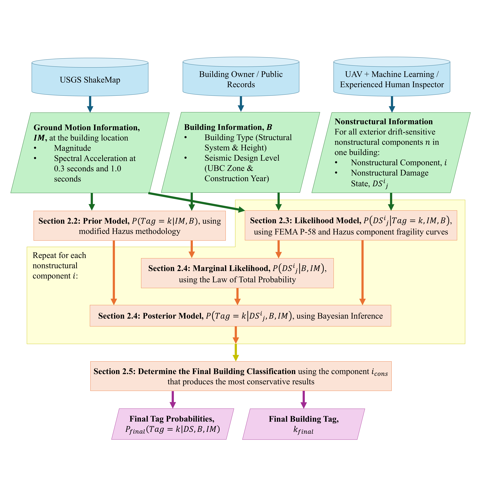

# Quantitative post-earthquake building condition inference from exterior drift-sensitive nonstructural damage observations

This GitHub repository is my code for the paper: Quantitative post-earthquake building condition inference from exterior drift-sensitive nonstructural damage observations. This paper was the featured article for that issue of the journal!

The paper can be found here: [Quantitative post-earthquake building condition inference from exterior drift-sensitive nonstructural damage observations](https://www.sciencedirect.com/science/article/pii/S0141029625007394)

If you use any part of this code, ideas, or figures below, please be sure to cite this paper!!

As this paper is part of my dissertation, I was the main designer and developer of the proposed methodology and was the sole developer of the code. My co-authors, Dr. Levine and Dr. Spencer, provided valuable feedback and tips to improve the methodology as supervisors of my research. Dr. Levine especially was vital to the structural engineering aspects of my research as an SE with years of structural engineering experience.

The focus of this paper was to develop an approach to infer quantitative post-earthquake building condition from exterior drift-sensitive nonstructural damage observations. First, the prior probabilities of a general building of a similar type being assigned a certain classification tag were calculated using a modified Federal Emergency Management Agency (FEMA) Hazus methodology. These prior probabilities were then updated using a Bayesian formulation, which incorporated the observed nonstructural damage and fragility models from FEMA P-58 and Hazus. Subsequently, the post-earthquake building condition was automatically and quantitatively inferred from exterior drift-sensitive nonstructural damage observations, using interstory drift ratio as the connecting engineering demand parameter. The approach was then validated using data from the 2014 South Napa Earthquake. This research represents a significant step toward developing effective strategies for automatic rapid post-earthquake building condition assessment.

Very detailed descriptions of what the code does can be found in the paper. The provided jupyter notebook gives an example of how the code can be used.

Note: Due to security reasons, only limited parts of the data are available. For the full 2014 Napa Earthquake dataset, please contact [Ayse Hortacsu](https://www.atcouncil.org/about-atc/employee-bios) at ATC to inquire.

If you would like a copy of the paper, please feel free to email me at: caseyjr2@illinois.edu
